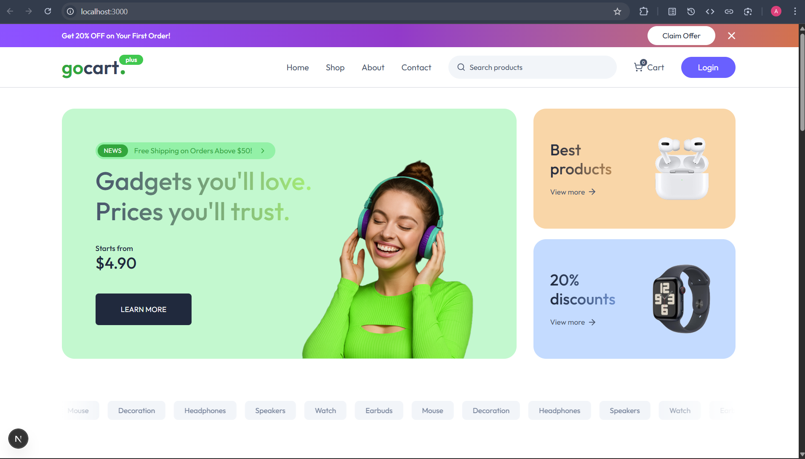

# GoCart AI Multi-Vendor E-Commerce App using Next.js

- forked the Next.js project template from [GreatStack/gocart-repo](https://github.com/GreatStackDev/gocart).
- After getting the copy of the template into local machine - open it in VsCode and do `pnpm install` to install necessary dependencies needed to build this app which are present in `package.json`
  - Which creates a new folder `node_modules` which will be ignored when we push the code to github and needed in our local machine to build our app locally with all the dependencies existing in there.
  - Had to update npm version -> `npm install -g npm@11.6.0`(anyone seeing this should ignore)
- create a new file `.env` and paste the env variable in `.env.example` file.
- To start the project - do `pnpm run dev` in terminal. And we see the following in terminal and on Browser
  

```bash
abhis@Tinku MINGW64 ~/Desktop/NextJs Projects/gocart (main)
$ pnpm run dev

> gocart@0.1.0 dev C:\Users\abhis\Desktop\NextJs Projects\gocart
> next dev --turbopack

   ▲ Next.js 15.3.5 (Turbopack)
   - Local:        http://localhost:3000
   - Network:      http://192.168.29.236:3000
   - Environments: .env

 ✓ Starting...
 ✓ Ready in 9.5s
 ○ Compiling / ...
 ✓ Compiled / in 6.9s
 GET / 200 in 8398ms
 ○ Compiling /favicon.ico ...
 ✓ Compiled /favicon.ico in 1060ms
 GET /favicon.ico?favicon.afbd3418.ico 200 in 1504ms
```

- The above picture we see on browser is a complete frontend template which has dummy data already present in `assets` & this a static website right now & we don't have any database as such.
- This frontend project template has already have `state management` - every thing we see when we launch the app is static data and state management included with all the pages.
- Now we will convert it into a functional multi vendor e-commerce app. Now let's explore the app which already have the pages and all.
- `app` folder : where we have added all the pages
  - `(public)` folder : public pages - where we will display the publicly available pages that the customer can see. In this we have the following pages where all of these folder-file have `page.jsx` file:
    - `cart`
    - `create-store`
    - `loading`
    - `orders`
    - `pricing`
    - `product`
    - `shop`
    - `page.jsx` is the home page -> we have mounted Hero, latestProducts, BestSelling, OurSpecs, Newsletter components.
    - `layout.jsx` - where we have added Banner, Navbar,Footer components as these will be displayed on all pages.
  - `components` folder -> In this we have all the remaining components.
    - we have separate components for `admin` and `store` dashboard.
  - `lib` folder(library) -> we have this `store.js` file - we have created a store using the reduxjs - to manage the store, we have multiple `features` and for each one we have created different `slice` file -> In which we define the state & initialize it & add `reducers` which have action functions like `addToCart` in `cartSlice.js` - created the state management using redux.
  - `assets` folder -> we have images and `assets.js` file -> we have imported all the images & exported them using `assets` object & access images easily in the app & we have also created `dummyData` for Ratings-reviews, categories, store data, product data, ourSpecsData, address data.
    - For each dummy data -> we have provided structure like id,name,description,mrp, price, images, category,storeID for productDummyData likewise for others as well, when we create backend we have to create databases and store it on tables by adding above structure properties.
  - For creating the table we have `prisma` folder - which have `schema.prisma` file - we have created the schema for our table. using `model` to database tables and create relations as well.
- for us to make our app full functional we first need to create Authentication feature & then we create database & tables using the `models`, after that we create backend api so we can update and get the data from database. we then link the api's to the components.
- let's start with login and registration functionality - create user authentication using `clerk` - which is a user authentication and user management platform. we can easily integrate it into Next.js, and also offers ready to use components like signin, singup, userprofile, subscription billing feature components as well, that we will integrate into the app. Go here and create an account in [clerk](https://clerk.com/nextjs-authentication) - [Dashboard](https://dashboard.clerk.com/apps)
  - create an application - name it `GoCart` - select Email and Google options - Select `Next.js` - install clerk in our app `pnpm add @clerk/nextjs`
  - Set your Clerk API keys - Add these keys to your `.env`.
  - create a file `middleware.ts` - in here we add configuration - The `clerkMiddleware` helper enables authentication and is where you'll configure your protected routes.
  - Add `ClerkProvider` to your app: The `ClerkProvidercomponent` provides Clerk's authentication context to your app. It's recommended to wrap your entire app at the entry point with ClerkProvider to make authentication globally accessible.Copy and paste the following file into your `layout.tsx` file. This creates a header with Clerk's prebuilt components to allow users to sign in and out. `app/layout.jsx`
  - Then we can start our project -> Create your first user -> `pnpm dev`


